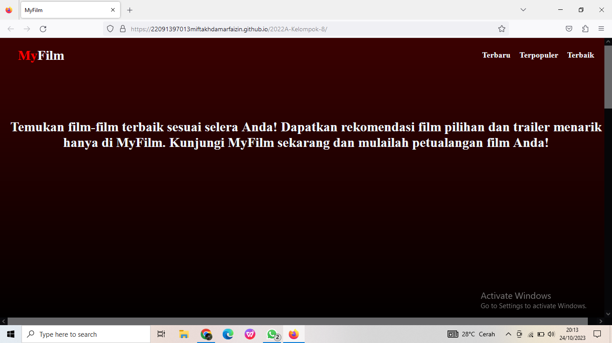
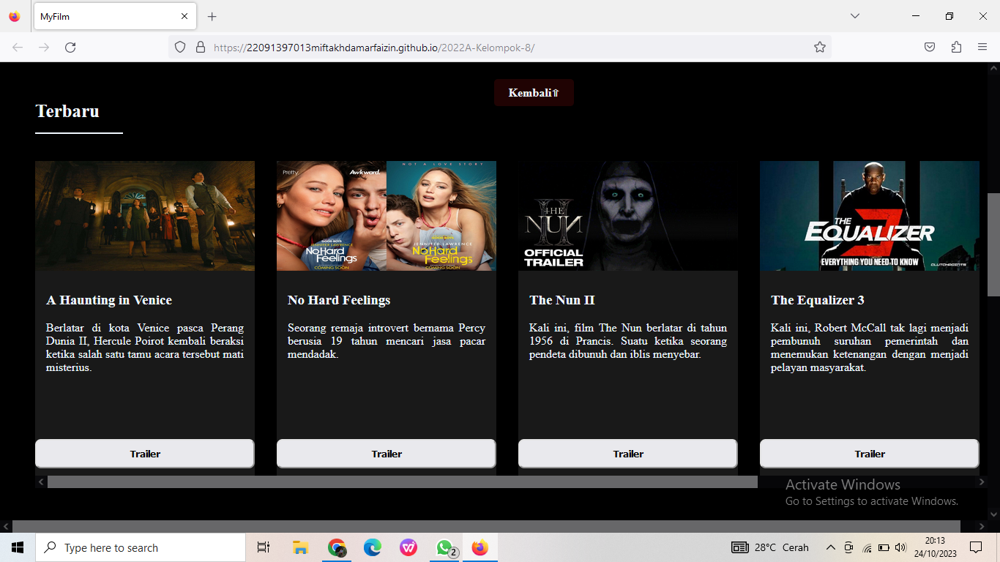
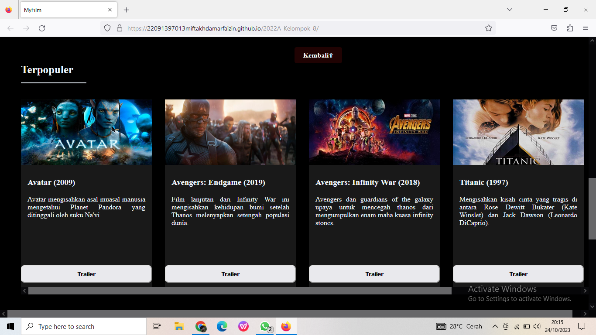
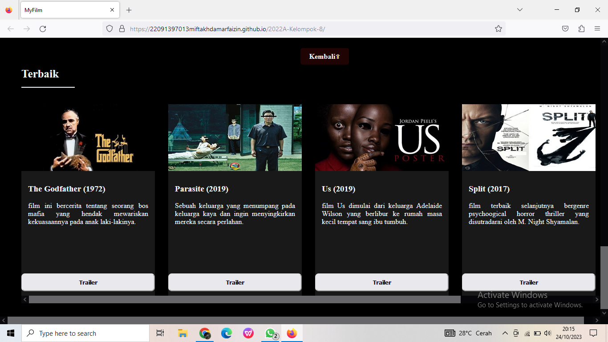
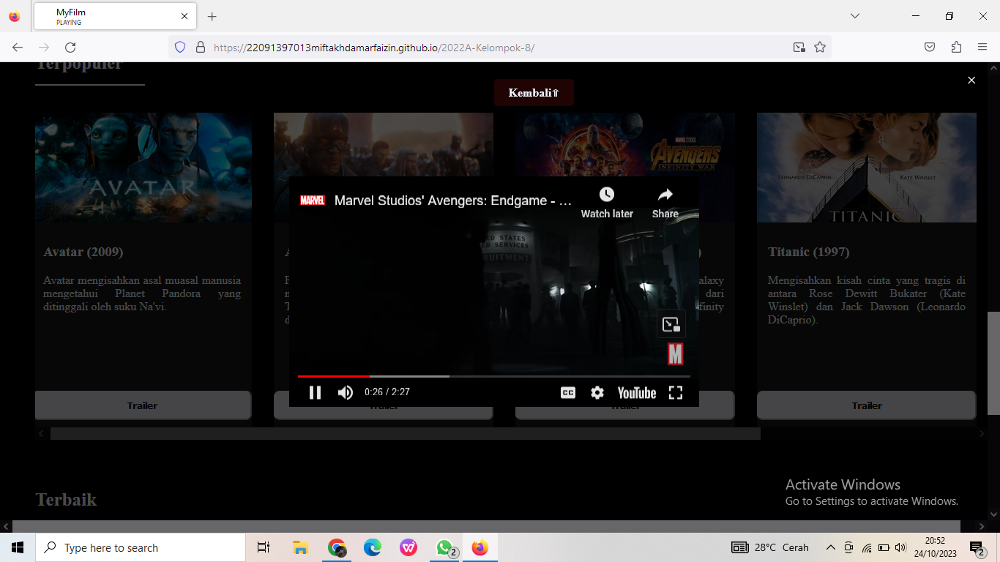
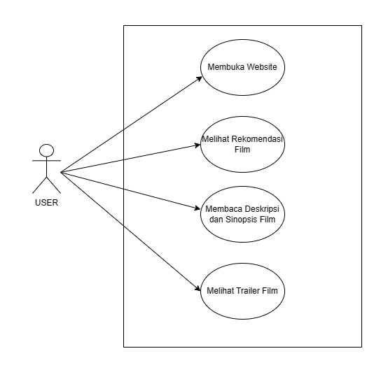

Software Requirements Specification 
 
Website Rekomendasi Film 

1. 22091397012 - Mohammad Resha Syahputra
2. 22091397013 - Miftakh Damar Faizin 
3. 22091397033 - Aryangga Putra Satrya 

Deskripsi  
Website "MyFilm" adalah sumber rekomendasi film yang menghadirkan beragam pilihan kepada pembacanya. Situs ini dirancang khusus untuk membantu pembaca menemukan film-film yang sesuai dengan preferensi dan selera mereka. Pengguna dapat dengan mudah mencari rekomendasi film yang cocok dengan apa yang mereka cari.

“MyFilm” menyajikan rekomendasi film dengan detail yang informatif. Setiap film dijelaskan dengan sinopsis singkat yang memberikan gambaran tentang alur cerita dan tema film tersebut. Selain itu, situs ini juga menyediakan akses mudah ke trailer film, sehingga pembaca dapat mendapatkan gambaran visual tentang film yang direkomendasikan. Semua ini bertujuan untuk memberikan pengalaman yang lebih lengkap dan informatif kepada pengguna dalam memilih film yang akan mereka tonton. Dengan begitu, “MyFilm” menjadi sumber terpercaya untuk menemukan film-film baru yang dapat dinikmati oleh para pecinta film.

Audien untuk website rekomendasi film
Myfilm mencakup penggemar film, pengguna berdasarkan genre, usia, penggemar aktor/aktris, seri TV, tahun rilis, rating, sejarah penonton, lokasi, pengguna berlangganan, dan pemasar film. Myfilm harus memahami dan memenuhi preferensi audiens ini, serta mengimplementasikan strategi pemasaran yang efektif dan analisis data pengguna untuk mencapai kesuksesan jangka panjang.

Desain User interface

Code HTML

1. !DOCTYPE html: Adalah deklarasi tipe dokumen (Document Type Declaration) yg digunakan untuk membuat dan mendesain halaman web.

2. html: Tag ini digunakan pada awal dari dokumen HTML.

3. head: Berisi informasi metadata tentang halaman web, seperti judud yg akan ditampilkan pada tab browser.

4. meta: Digunakan untuk metadata tambahan tentang halaman web dan untuk mengatur karakter set.
   
5. link: Digunakan untuk menghubungkan dokumen HTML dengan file "style.css".

6. title: Dalam HTML digunakan untuk menentukan judul dari halaman web.

7. body: Digunakan untuk menampung konten utama yg akan ditampilkan di halaman web seperti teks, gambar, dan tautan.

8. div: Tag ini digunakan untuk membuat divisi atau kontainer dalam halaman web.

9. h1: Digunakan untuk judul utama halaman.

10. h2: Digunakan untuk mengelompokkan konten menjadi bagian-bagian.

11. h3: Digunakan untuk judul sub bagian.

12. ul, li: Untuk membuat daftar tanpa urutan dengan elemen-elemen daftar.

13. a: Membuat tautan (hyperlink) ke halaman web atau sumber daya lainnya yg dapat diakses menggunakan internet.
    
14. img: Digunakan untuk menampilkan gambar dalam halaman web.
    
15. button: Digunakan untuk membuat tombol interaktif di halaman web seperti mengirimkan formuir, dan membuka jendela pop up.
    
16. p: Untuk mengatur teks atau paragraf pada halaman web.

Code CSS

1. background-color: Properti ini digunakan untuk mengatur warna latar belakang elemen. Misalnya, Anda dapat mengatur    warna latar belakang body atau elemen dengan kelas .containernavbar.

2. background-image: Digunakan untuk menambahkan gambar sebagai latar belakang elemen. Dengan properti ini, Anda         dapat menampilkan gambar sebagai latar belakang elemen dengan kelas .containernavbar.

3. background-size: Properti ini digunakan untuk mengatur ukuran latar belakang gambar pada elemen. Anda dapat             mengontrol seberapa besar atau kecil gambar latar belakang pada elemen .containernavbar.

4. height: Properti ini digunakan untuk mengatur tinggi elemen. Contohnya, Anda dapat mengatur tinggi elemen dengan        kelas .containernavbar.

5. display: Digunakan untuk mengatur tampilan elemen. Properti ini sering digunakan pada elemen seperti .navbar,           .hiro, .daftarfilm, .card, dan .konten untuk mengontrol bagaimana elemen-elemen tersebut ditampilkan di halaman.

6. justify-content: Properti ini digunakan untuk mengatur penyebaran elemen secara horizontal. Anda dapat                  menggunakannya pada elemen seperti .navbar dan .card untuk mengatur bagaimana elemen-elemen tersebut berada dalam           satu baris secara horizontal.

7. padding: Digunakan untuk mengatur jarak dalam elemen. Properti ini sering digunakan pada elemen seperti .navbar,        .hiro, .card, .sinopsis, dan .konten button untuk menambahkan ruang di sekitar kontennya.

8. position: Properti ini digunakan untuk mengatur posisi elemen. Biasanya digunakan pada elemen seperti .navbar           untuk mengontrol bagaimana elemen tersebut ditempatkan dalam halaman web.

9. font-size: Digunakan untuk mengatur ukuran font teks. Anda dapat mengubah ukuran teks pada elemen seperti              .navbar h1, .navbar ul li a, .hiro h2, #terbaru h1, #terpopuler h1, dan #terbaik h1 untuk mengatur tampilan teks           sesuai kebutuhan.

10. color, tag ini digunakan untuk mengatur warna teks yang telah dimasukkan. Tag ini terdapat pada elemen ‘.navbar h1’, ‘.navbar span’, ‘.navbar ul li a’, ‘.hiro h2’, ‘.konten .sinopsis h3’, ‘.konten .sinopsis p’, ‘#terbaru h1’, ‘#terpopuler h1’, dan ‘#terbaik h1’.

11. text-decoration, tag ini digunakan untuk mengatur dekorasi yang terdapat pada teks yang dimasukkan. Tag ini terletak pada elemen ‘.navbar ul li a’ dan ‘.konten button a’.

12. transition, tag ini digunakan untuk mengatur efek transisi pada elemen saat pengguna melakukan interaksi dengan elemen. Tag ini digunakan pada elemen '.navbar ul li a', '.konten button', '.konten button a', dan '.konten button:hover.'

13. flex-direction, tag ini digunakan untuk mengatur arah tata letak elemen yang ditampilkan dengan perintah display: flex. Tag ini digunakan pada '#terbaru', '#terpopuler', dan '#terbaik'.

14. gap, tag ini difungsikan untuk mengatur jarak antar elemen yang telah dimasukkan dalam display: flex. Tag ini terdapat pada elemen '.navbar ul', '.daftarfilm', dan '.card'.

15. border-bottom, tag ini digunakan untuk menambahkan garis bawah pada teks. Tag ini terdapat pada '#terbaru h1', '#terpopuler h1', dan '#terbaik h1'.

16. max-height dan min-height, tag ini digunakan untuk mengatur tinggi elemen paling maksimum dan paling minimum. Tag ini terdapat pada elemen '.konten .sinopsis' dan '.konten .sinopsis p'.

17. width, tag ini digunakan untuk mengatur lebar elemen pada tampilan halaman website. Tag ini terdapat pada elemen '.card', '.konten img', dan '.konten button'.

18. border-radius, tag ini digunakan untuk mengatur radius atau lengkungan pada sudut elemen. Tag ini terdapat pada elemen '.konten button'.

 Code Javascript

 1. window.addEventListener("scroll", function () { ... });: digunakan untuk event listener yang menangani peristiwa scroll (gulir) pada halaman. Saat pengguna menggulir halaman web, kode dalam fungsi ini akan dieksekusi.
    
 2. let backToTop = document.getElementById("back-to-top");: digunakan untuk Mendeklarasikan variabel backToTop yang menyimpan elemen HTML dengan ID "back-to-top".
 
 3. let containernavbar = document.querySelector(".containernavbar");: digunakan untuk menyimpan elemen HTML pertama yang ditemukan dengan kelas CSS "containernavbar".

 4. if (window.scrollY > containernavbar.clientHeight) { ... }: digunakan untuk memeriksa apakah pengguna telah menggulir lebih dari tinggi elemen yang memiliki kelas "containernavbar".

 5. let openButtons = document.querySelectorAll(".openVideo");: digunakan untuk menyimpan semua elemen dengan kelas CSS "openVideo". mungkin merujuk pada tombol yang membuka video.

 6. let videoPopup = document.getElementById("videoPopup");: digunakan untuk menyimpan elemen HTML dengan ID "videoPopup" dan menampilkan pop-up video.

 7. let videoIframe = document.getElementById("videoIframe");: digunakan untuk menyimpan elemen HTML dengan ID "videoIframe" dan menampilkan video YouTube.

 8. let closeVideo = document.getElementById("closeVideo");: digunakan untuk menyimpan elemen HTML dengan ID "closeVideo" dan menutup pop-up video.

 9. openButtons.forEach(function(button) { ... });: digunakan untuk menambahkan event listener ke setiap elemen yang memiliki kelas "openVideo". Saat elemen ini diklik, akan menampilkan pop-up video.

 10. closeVideo.addEventListener("click", function () { ... });: menambahkan event listener ke elemen dengan ID "closeVideo" yang akan menutup pop-up video. Saat diklik, sumber iframe diubah menjadi "about:blank" dan pop-up video disembunyikan.

 11. videoPopup.addEventListener("click", function(event) { ... });: menambahkan event listener ke elemen dengan ID "videoPopup" yang akan menutup pop-up video jika pengguna mengklik di luar area video.
 
 
4.1	Use Case Diagram 

  
4.2    Use Case 
	4.1.1 	Deskripsi Use Case  
1.	User : User dapat melakukan kegiatan penting pada  website seperti membaca sinopsis film dan menonton trailer film.
 
 
4.3    Flowchart

 
 
 
