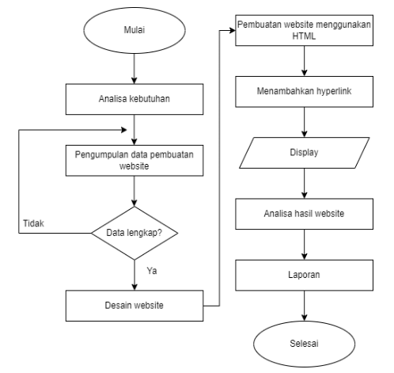

# 2022A-Kelompok8

 
 
Software Requirements 
Specification 
for 
     Website
Rekomendasi Film 
Version 1.0 approved 
Prepared by  

22091397012 – Mohammad Resha Syahputra
22091397013 - Miftakh Damar Faizin 
22091397033 - Aryangga Putra Satrya 
 
 
 
 
11 September 2023
1 
 
Daftar Isi 
 
Daftar Isi	1
1. 	Pendahuluan	2
1.1 	Tujuan Penulisan Dokumen	2
1.2 	Audien yang Dituju dan Pembaca yang Disarankan	2
1.3 	Batasan Produk	2
1.4 	Definisi dan Istilah	2
1.5   Referensi	3
2. 	Deskripsi Keseluruhan	4
2.1 	Deskripsi Produk	4
2.2 	Fungsi Produk	4
2.3 	Penggolongan Karakterik Pengguna	4
2.4 	Lingkungan Operasi	4
2.5 	Batasan Desain dan Implementasi	4
2.6 	Dokumentasi Pengguna	5
3. 	Kebutuhan Antarmuka Eksternal	5
3.1 	User Interfaces	5
3.2	Hardware Interface	5
3.3 	Software Interface	5
3.4 	Communication Interface	5
4. Kebutuhan Fungsional	5
4.1	Use Case Diagram	6
4.2    Use Case	6
4.1.2 Stimulus and Respon	6
4.1.4 Activity Diagram	6
4.3    Flowchart	7
5. Kebutuhan Non Fungsional	8

 
 
 
 
 
 
 
 
1. 	Pendahuluan 
1.1 	Tujuan Penulisan Dokumen 

1.2 	Audien yang Dituju dan Pembaca yang Disarankan 
  
1.3 	Batasan Produk 
  
1.4 	Definisi dan Istilah 
No 	Istilah 	Definisi 
1. 	SKPL 	SKPL (Spesifikasi Kebutuhan Perangkat Lunak) adalah dokumen hasil analisis yang berisi spesifikasi kebutuhan pengguna. 
2. 	IEEE 	IEEE (Institute of Electrical and Electronics Engineers) adalah sebuah organisasi yang mengurusi masalah pengembangan teknologi yang berhubungandengan keteknikan elektro dan elektronika. 
3. 	ERD 	ERD (Entities Relationship Diagram) adalah suatumodel untuk menjelaskan hubungan antar datadalam basis data berdasarkan objek-objek dasardata yang mempunyai hubungan antar relasi. 
4. 	Use Case Diagram 	Use Case Diagram adalah proses penggambaran yang dilakukan untuk menunjukkan hubungan antara pengguna dengan sistem yang dirancang. 
5. 	User 	Pengguna. 
6.	Flowchart	Flowchart adalah representasi grafis dari alur kerja atau proses yang digambarkan dengan menggunakan simbol-simbol, panah, dan bentuk-bentuk lainnya. Tujuan utama dari flowchart adalah untuk menggambarkan secara visual bagaimana suatu proses atau alur kerja berjalan, sehingga memudahkan pemahaman, analisis, dan dokumentasi.

1.5   Referensi 
2. 	Deskripsi Keseluruhan 
2.1 	Deskripsi Produk  
Website "MyFilm" adalah sumber rekomendasi film yang menghadirkan beragam pilihan kepada pembacanya. Situs ini dirancang khusus untuk membantu pembaca menemukan film-film yang sesuai dengan preferensi dan selera mereka. Pengguna dapat dengan mudah mencari rekomendasi film yang cocok dengan apa yang mereka cari.

“MyFilm” menyajikan rekomendasi film dengan detail yang informatif. Setiap film dijelaskan dengan sinopsis singkat yang memberikan gambaran tentang alur cerita dan tema film tersebut. Selain itu, situs ini juga menyediakan akses mudah ke trailer film, sehingga pembaca dapat mendapatkan gambaran visual tentang film yang direkomendasikan. Semua ini bertujuan untuk memberikan pengalaman yang lebih lengkap dan informatif kepada pengguna dalam memilih film yang akan mereka tonton. Dengan begitu, “MyFilm” menjadi sumber terpercaya untuk menemukan film-film baru yang dapat dinikmati oleh para pecinta film.

2.2 	Fungsi Produk  
 
 
2.3 	Penggolongan Karakterik Pengguna 
 
Tabel 1 Karakteristik Pengguna 
Kategori Pengguna 	Tugas 	Hak Akses ke aplikasi 	Kemampuan yang harus dimiliki 
User 	User dapat melakukan kegiatan penting pada  website seperti membaca sinopsis film dan menonton trailer film.
 	Melihat website 	Memahami cara 
kerja website 
 
 
 
2.4 	Lingkungan Operasi  
 
 
2.5 	Batasan Desain dan Implementasi  

 
2.6 	Dokumentasi Pengguna 
 
 
3. 	Kebutuhan Antarmuka Eksternal 
3.1 	User Interfaces  

 
 
3.2	Hardware Interface 
       	 
3.3 	Software Interface 

3.4 	Communication Interface 
 
 	 
4. Kebutuhan Fungsional 
 
 
4.1	Use Case Diagram 

  
4.2    Use Case 
	4.1.1 	Deskripsi Use Case  
1.	User : User dapat melakukan kegiatan penting pada  website seperti membaca sinopsis film dan menonton trailer film.
 
4.1.2 Stimulus and Respon 
 
 
4.1.4 Activity Diagram 
 
 
 
 
 
4.3    Flowchart
   	    
5. Kebutuhan Non Fungsional 
 
 
